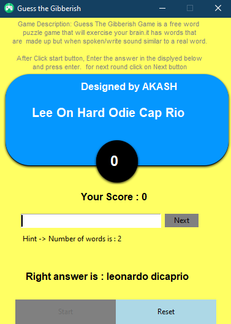

# Guess-the-Gibberish

Gibberish (sometimes Jibberish) is a language game that is played in the United States and Canada by adding "idig" to the beginning of each syllable of spoken words. Similar games are played in many other countries. The name Gibberish refers to the nonsensical sound of words spoken according to the rules of this game.

## Output:

